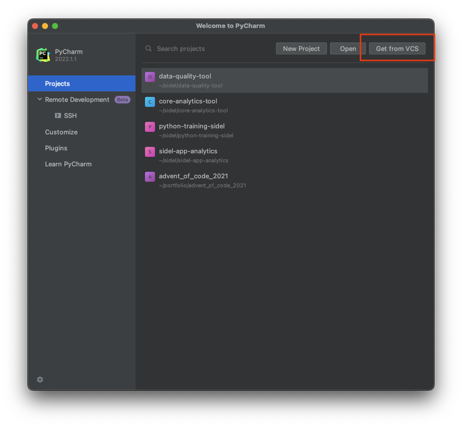
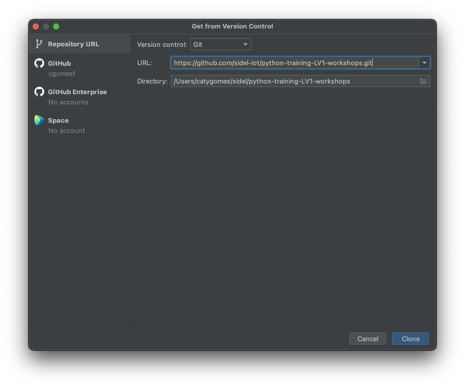
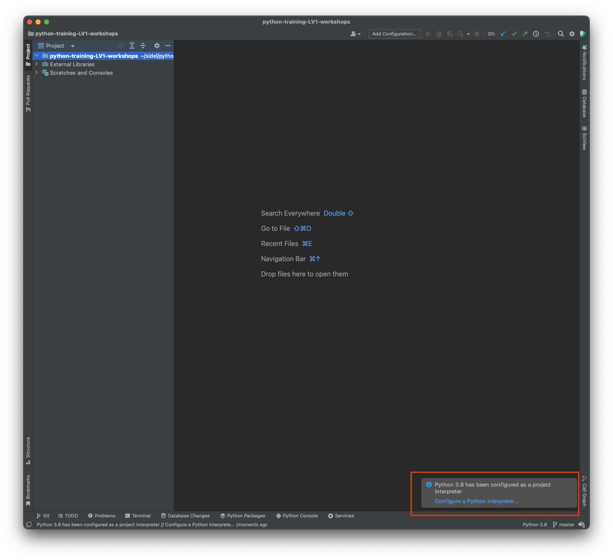
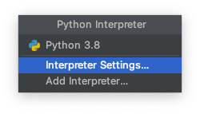
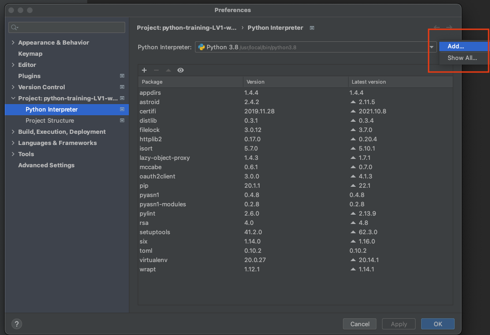
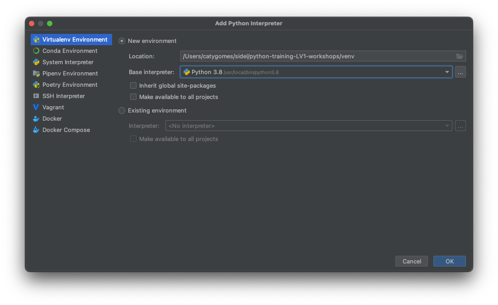
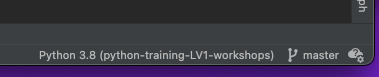

# Welcome to the Python Level 1 Workshops ! 

This guide will walk you through the setup of this project on your local machine. 


## 1. Clone the repo

If you don't see the "Welcome to PyCharm" window, please close any open projects. 

**Click on "Get from VCS".**



Insert the link for this repository and click "Clone".
```
https://github.com/sidel-iot/python-training-LV1-workshops.git
```



## 2. Configure the Python interpreter / virtual environment

Pycharm will immediately prompt you that a default interpreter was set up. 
We are going to change this. 

If you don't see the prompt, you can always find the settings via the PyCharm menu (in the Preferences/Settings, search for Python interpreter).

**Click on "Configure a Python interpreter..."**



**Click on "Configure a Python interpreter..."**, then **Interpreter Settings...**



Click on the cog icon, then on "Add..". 



For our project, we will choose to create a new Virtual Environment, which is usually already chosen by default.
Just verify that the fields are filled in correctly. You may see a different version for Python, and that's fine ! 

Click on OK. 




Double check that the virtual environment is now being used by the IDE. You can find that info on the bottom right of the screen. 



