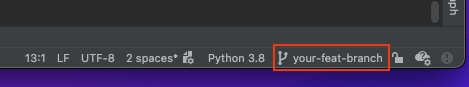
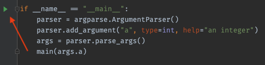
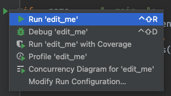
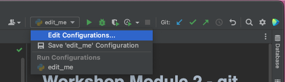
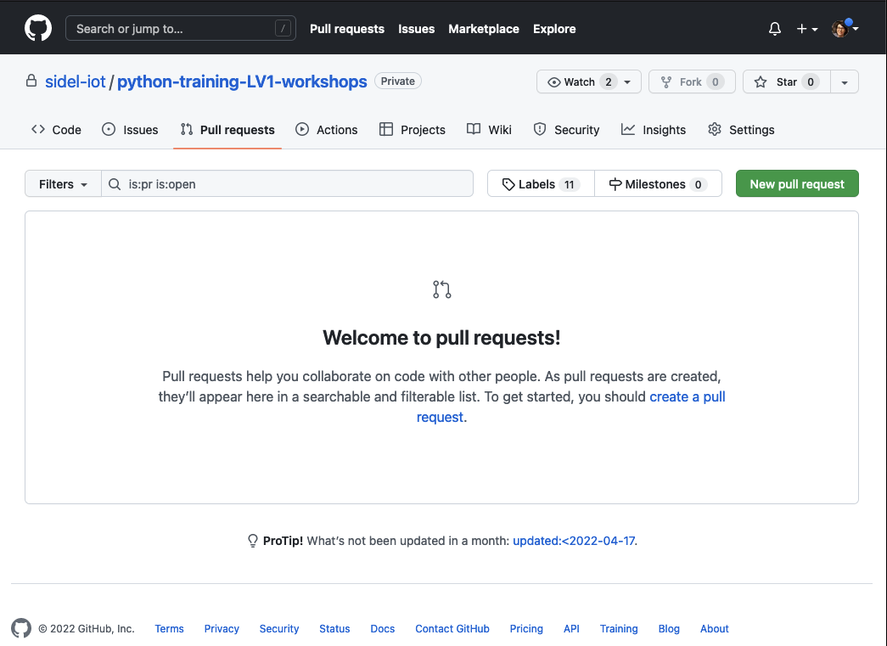
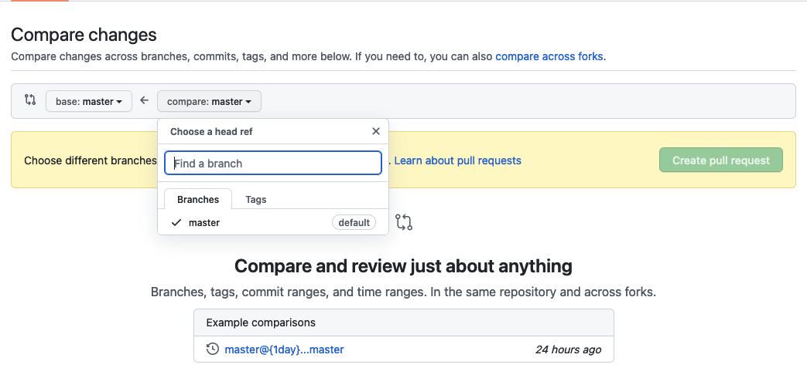

# Workshop Module 2 - git for collaboration


In this workshop, you will learn how to use the PyCharm IDE to:
* create a new feature branch with some changes
* edit a Run Configuration
* push your feature branch to GitHub
* create a Pull Request


## 1 - Prepare your local workspace

Before you do anything, make sure you are starting off a clean and up-to-date workspace !

That means:
- you pulled the latest changes (`git pull`)
- you don't have any other ongoing changes (`git status` says everything is OK !)

## 2 - Create a branch

* Create a branch with a unique name. 
  * For the purpose of this exercise, you can use the filename from the previous workshop. 
  But obviously try to give your branches proper names to that you and your colleagues understand what your feature does!
```
git checkout -b <your-branch-name>
```
* Double check that you switched branches correctly:
  * Run `git status` and read the output. The first sentence tells you which branch you are on.
  * Run `git branch` to list all your local branches. The active branch will be preceded by an asterisk (*).
  * The current branch name also appears on the bottom right of the PyCharm IDE window, although it may take a few seconds to refresh.
  * Lastly, you can also check the "Git" tab.




## 3 - Execute your script

* Open the file `module-2/sources/edit_me.py`.
* Execute the script by simply clicking the green arrow icon on the left of line 8.







* The script will fail because it's **missing an input argument**.  
You will need to edit the Run Configurations.
Fortunately, by clicking the green arrow, this will have already created a configuration without arguments ! 
You can find it on the upper right corner of the IDE, or in the program menu under Run -> Edit Configurations...  



* Enter any number in the "Parameters: " textbox.
* Apply and save.


## 4 - Add changes

* Edit the file until the AssertionError is resolved.
* Commit your changes.


## 5 - Push your branch

Right now your branch only exists in your local workspace.
To make your branch available on the remote repository, you need to push your branch. 

* Run `git push`. This fails because there is no upstream branch. In fact, for the first push, you need to create the
remote branch first:
```
git push --set-upstream origin <your-random-branch-name>
```

Your branch is now visible on GitHub. Note that for any subsequent changes to this branch, you can now simply `git push`.


## 6 - Open a Pull Request

* On your browser, go to the GitHub page for this repository. 
* Navigate to the "Pull requests" tab. 



* Click on the green "New pull request" button on the upper right.
* By default, this will compare `main` with `main`. Replace the right-hand branch with your feature branch. 



* Fill in the title then click "Create pull request".
